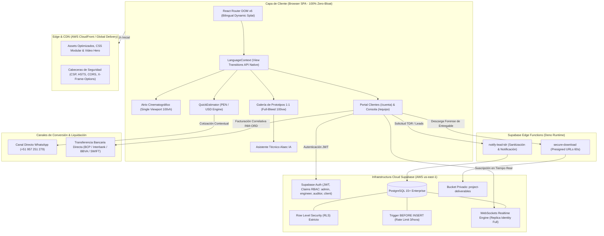

# Inmerge — Plataforma Web Corporativa & Consola de Ingeniería

<div align="center">

```
  ___ _   _ __  __ _____ ____   ____ _____
 |_ _| \ | |  \/  | ____|  _ \ / ___| ____|
  | ||  \| | |\/| |  _| | |_) | |  _|  _|
  | || |\  | |  | | |___|  _ <| |_| | |___
 |___|_| \_|_|  |_|_____|_| \_\\____|_____|
```

**Firma Boutique de Consultoría en Ingeniería de Software, Auditoría de Sistemas y Ciencia de Datos**  
_Lima, Perú · 08°06′S 79°01′W · [https://inmerge.pe](https://inmerge.pe)_

[](https://github.com/pcamacho447/inmerge-web-site)
[](https://github.com/pcamacho447/inmerge-web-site)
[](https://www.w3.org/WAI/standards-guidelines/wcag/)
[](https://github.com/pcamacho447/inmerge-web-site)
[-gold?style=flat-square>)](https://inmerge.pe/en)
[](LICENSE)

</div>

---

## 🏛️ Visión General & Propósito

**Inmerge** es una plataforma de software integral concebida para organizaciones que demandan rigor técnico, arquitectura resiliente y soberanía de datos. Diseñada bajo la filosofía **Editorial Tech Premium** y fusionada con la herencia arquitectónica prehispánica Mochica-Chimú, la plataforma unifica:

1. **Atrio Cinematográfico & Monografía de Ingeniería (Público):** Presentación monumental de soluciones técnicas de alto calibre, Cédula Curatorial de Prototipos 1:1, cotizador ágil interactivo en PEN/USD y asistente técnico impulsado por IA (_Alaec_).
2. **Portal de Clientes Bilingüe (`/cuenta` / `/en/account`):** Espacio exclusivo donde clientes corporativos supervisan el estado de salud de sus sistemas, cronogramas Gantt en tiempo real, facturación fiscal dual y descarga forense auditada de entregables con URLs temporales firmadas.
3. **Consola Operacional de Consultores (`/equipo`):** Panel editorial full-canvas (100vw/100vh) para el equipo técnico en Lima, equipado con telemetría KPI Bento, Paleta de Comandos global (`⌘K`), espacio de trabajo Maestro-Detalle Split (60/40), Tablero Kanban de Fases Metodológicas y bitácora forense inmutable sobre PostgreSQL.

---

## 📐 Los Tres Pilares Estratégicos

Inmerge estructura su oferta técnica en tres disciplinas fundamentales:

```
┌────────────────────────────────────────────────────────────────────────────────────────┐
│                                   INMERGE CONSULTING                                   │
├──────────────────────────┬─────────────────────────────┬───────────────────────────────┤
│  01. PÁGINAS WEB         │  02. INGENIERÍA DE SOFTWARE │  03. INTELIGENCIA DE NEGOCIOS │
│  & PLATAFORMAS DIGITALES │  & ARQUITECTURA CLOUD (AWS) │  & AUDITORÍA TÉCNICA DE DATOS │
├──────────────────────────┼─────────────────────────────┼───────────────────────────────┤
│ • Landings de Alto Imp.  │ • Arquitecturas Serverless  │ • Auditoría Forense de Datos  │
│ • Sitios Web Editoriales │ • Microservicios en AWS ECS │ • Detección Inconsistencias   │
│ • Portales Interactivos  │ • APIs REST de Alto Tráfico │ • Dashboards BI en Tiempo Real│
│ • Rendimiento CWV 100/100│ • Bases PostgreSQL / Aurora │ • Modelos Machine Learning    │
│ • SEO Técnico Bilingüe   │ • Modernización de Monolitos│ • Agentes & Flujos GenAI      │
└──────────────────────────┴─────────────────────────────┴───────────────────────────────┘
```

### 1. Pilar 01 — Páginas Web & Plataformas Digitales

- **Landings de Alto Impacto:** Sitios concebidos para conversión técnica B2B, tiempos de carga inferiores a 800ms, puntuación perfecta en Core Web Vitals (LCP, FID, CLS) y animaciones aceleradas por GPU.
- **Sitios Web Corporativos Editoriales:** Plataformas institucionales sobre lienzo continuo mineral con tipografía balanceada, accesibilidad WCAG 2.1 AA y adaptabilidad total a dispositivos.
- **Portales Web a Medida:** Aplicaciones dinámicas con autenticación, pasarelas bilingües y renderizado ultra-rápido sin dependencias pesadas.

### 2. Pilar 02 — Ingeniería de Software & Arquitectura Cloud

- **Infraestructura Cloud en AWS:** Topologías escalables basadas en AWS ECS (Fargate), AWS Lambda, Amazon RDS (PostgreSQL/Aurora), Amazon S3 y Amazon CloudFront.
- **Microservicios & APIs Empresariales:** Desarrollo en Node.js, Python y Go con contratos estrictos de interfaz (OpenAPI/TDR), alta disponibilidad y tolerancia a fallos.
- **Modernización de Sistemas Legados:** Desacoplamiento de monolitos obsoletos, refactorización con cero tiempo de inactividad (_zero-downtime_) y optimización de bases de datos relacionales.

### 3. Pilar 03 — Inteligencia de Negocios & Ciencia de Datos

- **Auditoría Técnica & Calidad de Datos:** Análisis forense de esquemas, detección y resolución de duplicados, saneamiento de inconsistencias y certificación de integridad.
- **Dashboards Ejecutivos Real-Time:** Paneles gerenciales interactivos alimentados por WebSockets y consultas SQL optimizadas para telemetría continua de KPIs.
- **Machine Learning & Modelos Predictivos:** Algoritmos de forecasting de demanda, scoring crediticio/riesgos e integración de agentes IA cognitivos con arquitectura RAG.

---

## 🏛️ Topología de Arquitectura



---

## 🎨 Sistema de Diseño: Editorial Tech & Motivos Mochica

La identidad gráfica fusiona la pulcritud editorial con la iconografía geométrica de la civilización Mochica-Chimú del norte peruano:

### 1. Paleta Cromática Mineral

| Variable CSS   | Hex       | Rol Semántico en la Plataforma                                                       |
| -------------- | --------- | ------------------------------------------------------------------------------------ |
| `--bg`         | `#F3EADA` | **Arena Mineral:** Lienzo continuo principal de lectura y descanso visual.           |
| `--ink`        | `#241A12` | **Tinta Profunda:** Tipografía de máxima legibilidad y contrastes del Atrio.         |
| `--terracotta` | `#A8472B` | **Terracota Moche:** Acento principal, botones primarios (`.btn-accent`) y cursores. |
| `--gold`       | `#D8A84E` | **Oro Ceremonial:** Indicadores de excelencia, estados activos y badges de calidad.  |
| `--ochre`      | `#C68A3D` | **Ocre:** Elementos secundarios, marcadores técnicos y estados intermedios.          |
| `--cream2`     | `#EBDFC9` | **Crema Arquitectónico:** Superficies alternas, fondos de panel e inputs de datos.   |

### 2. Tipografía Canónica

- **`Space Grotesk` (`var(--font-sans)`, `var(--font-display)`):** Diseñada para legibilidad técnica, titulares monumentales, cuerpo de texto editorial, interfaces de usuario y formularios.
- **`Space Mono` (`var(--font-mono)`):** Diseñada para datos tabulares, telemetría de sistemas, coordenadas geográficas (`08°06′S 79°01′W`), códigos de orden correlativos (`INM-ORD-...`) y metadatos de auditoría.

### 3. Componentes Geométricos Mochica en SVG Puro

- **`<MochicaDivider />`:** Cenefa arquitectónica modular continua con líneas escalonadas y grecas consecutivas inspiradas en las Huacas del Sol y de la Luna.
- **`<MochicaStepIcon />`:** Glifos escalonados de sustentación ceremonial empleados en el podio de Propósito, Misión y Visión.
- **`<MochicaCornerFrame />`:** Marcos con esquinas escalonadas y grecas ortogonales para tarjetas del Método Inmerge.
- **`<MochicaPodiumBase />`:** Plinto monumental de anclaje visual para remate de secciones monográficas.

---

## 🗺️ Mapa Completo de Navegación & Rutas

### Rutas Públicas (Bilingües Paridad Total `ES` / `EN`)

| Ruta Español     | Ruta Inglés        | Experiencia de Usuario & Módulos Clave                                                                                                                                                                                                                                                                                                                                                                                                                                                    |
| ---------------- | ------------------ | ----------------------------------------------------------------------------------------------------------------------------------------------------------------------------------------------------------------------------------------------------------------------------------------------------------------------------------------------------------------------------------------------------------------------------------------------------------------------------------------- |
| **`/`**          | **`/en`**          | **Atrio Cinematográfico (Single Viewport 100vh):** Video hero inmersivo, efecto máquina de escribir (_typewriter_) accesible, coordenadas geográficas, tríptico de portales directos hacia Servicios, Nosotros y Contacto, y micro-footer integrado.                                                                                                                                                                                                                                      |
| **`/servicios`** | **`/en/services`** | **Monografía Curatorial & Galería de Prototipos 1:1:** Lienzo a 100vw. Exhibición monumental del prototipo activo, Lightbox de inspección a pantalla completa con atajos de teclado (`[ ← ]` / `[ → ]` / `[ ESC ]`), selector de las 3 Líneas de Servicio (`01 Páginas Web`, `02 Ingeniería de Software`, `03 Inteligencia de Negocios`), banco curatorial de especificaciones y Estimador Ágil (`<QuickEstimator />`) en PEN/USD con enlace directo a WhatsApp y asistente IA (_Alaec_). |
| **`/nosotros`**  | **`/en/about`**    | **Nosotros & Metodología Inmerge:** Manifiesto de ingeniería, Podio ceremonial Mochica (Propósito, Misión, Visión con zócalo de sustentación), carrusel editorial de Directores de Práctica (`<DirectorsCarousel />`) con scroll virtual sincronizado, Bento Grid del Método Inmerge (4 fases) y explorador de tecnologías curadas.                                                                                                                                                       |
| **`/contacto`**  | **`/en/contact`**  | **Contacto & Términos de Referencia (TDR):** Formulario estructurado B2B con selector de pilares, honeypot anti-spam invisible, limitador de tasa transaccional (3 envíos/hora), compromisos de nivel de servicio (SLA), datos institucionales, anclaje `<MochicaDivider />` y enlace contextual pre-rellenado a WhatsApp.                                                                                                                                                                |
| **`/cookies`**   | **`/en/cookies`**  | **Política de Cookies & Privacidad:** Declaración de cookies técnicas esenciales y panel modal accesible para configuración de preferencias de almacenamiento.                                                                                                                                                                                                                                                                                                                            |

### Rutas de Clientes & Autenticación (Bilingües `ES` / `EN`)

| Ruta Español    | Ruta Inglés        | Rol / Funcionalidad                                                                                                                                                                                                                                                                 |
| --------------- | ------------------ | ----------------------------------------------------------------------------------------------------------------------------------------------------------------------------------------------------------------------------------------------------------------------------------- |
| **`/login`**    | **`/en/login`**    | Inicio de sesión corporativo con Supabase Auth, validación accesible y autocompletado nativo.                                                                                                                                                                                       |
| **`/registro`** | **`/en/register`** | Creación de cuenta cliente con soporte fiscal dual (RUC 11 dígitos para Perú / Tax ID internacional).                                                                                                                                                                               |
| **`/cuenta`**   | **`/en/account`**  | **Portal de Clientes Bilingüe:** Seguimiento de proyectos propios, cronogramas Gantt interactivos con zoom Semanas/Meses, semáforo de salud de hitos, estados de órdenes de pago (`INM-ORD-...`) y descarga segura de informes técnicos con URLs firmadas temporales (60 segundos). |

### Consola Operacional de Consultores (Exclusivo en Español)

| Ruta          | Audiencia & Seguridad                                                                            | Módulos & Capacidades Operativas                                                                                                                                                                                                                                                                                                                                                                                  |
| ------------- | ------------------------------------------------------------------------------------------------ | ----------------------------------------------------------------------------------------------------------------------------------------------------------------------------------------------------------------------------------------------------------------------------------------------------------------------------------------------------------------------------------------------------------------- |
| **`/equipo`** | **Roles Autorizados:** `admin`, `engineer`, `auditor` (Redirección obligatoria desde `/cuenta`). | **Consola Editorial Full-Canvas (100vw/100vh):** Resumen ejecutivo Bento KPI, Paleta de Comandos interactiva (`⌘K` / `Ctrl+K`) con búsqueda difusa instantánea, espacio de trabajo Maestro-Detalle Split (60/40), Tablero Kanban de Fases Metodológicas Inmerge, Slide-Over Drawer segmentado (`[🚀 Proyecto]`, `[⚡ Hito]`, `[📦 Entregable]`, `[👥 Staff]`), y gestión in-situ de entregables con hash SHA-256. |

---

## 🔒 Seguridad, Resiliencia y Políticas de Negocio

1. **Honeypot Invisible Anti-Bot:** El formulario de contacto incluye un campo oculto fuera del viewport (`website_url_hp`). Cualquier bot automatizado que lo complete sufre un _shadow-ban_ silencioso (`{ success: true, isSpamFiltered: true }`), suprimiendo inserciones en base de datos y llamadas a Edge Functions.
2. **Rate Limiting Transaccional en PostgreSQL:** Trigger `BEFORE INSERT` en `public.leads_tdr` con índice compuesto `idx_leads_tdr_email_created_at`. Restringe a un máximo estricto de **3 solicitudes por correo por hora**, canalizando al usuario hacia WhatsApp si se supera el umbral y auditando el evento en la bitácora técnica.
3. **Row Level Security (RLS) de Menor Privilegio:**
   - Tablas de clientes, proyectos, hitos y entregables restringidas al `client_id` propietario o roles técnicos (`admin`, `engineer`, `auditor`).
   - Descargas de archivos a través de la Edge Function `secure-download` con comprobación de sesión y generación de URLs firmadas de corta duración.
4. **Inmutabilidad Forense de Auditoría:** `REVOKE UPDATE, DELETE ON public.team_activity_logs` garantiza que ningún registro de actividad, error o cambio de estado pueda ser modificado o purgado.
5. **Política Anti-Bloqueos (`window.alert` prohibido):** Toda retroalimentación de sistema se proyecta con `<ToastNotification />` utilizando atributos ARIA `role="status"` o `role="alert"`.
6. **Medio de Pago Exclusivo:** Se aceptan única y exclusivamente **Transferencias Bancarias Directas** a cuentas corporativas de Inmerge (BCP, Interbank, BBVA en PEN para Perú; transferencias internacionales SWIFT/Wire en USD para el exterior). No se emplean pasarelas de pago automáticas para preservar el modelo de consultoría boutique sin comisiones transaccionales.

---

## 📁 Estructura del Repositorio

```text
inmerge/
├── .agents/                          # Directrices de pair-programming y arquitectura de marca
│   └── rules/inmerge-brand-architecture.md
├── docs/                             # Especificaciones de arquitectura, producto y diseño
│   ├── architecture.md               # Especificación técnica del Spine de arquitectura
│   ├── decisions-log.md              # Bitácora histórica de sesiones y decisiones
│   ├── design.md                     # Directrices de diseño y tokens visuales
│   ├── prd.md                        # Documento de Requerimientos de Producto (PRD)
│   ├── tasks.md                      # Backlog de historias de usuario y épicas de desarrollo
│   └── ux/                           # Especificaciones UX (DESIGN.md & EXPERIENCE.md)
├── supabase/                         # Migraciones maestras e infraestructura BaaS
│   ├── functions/                    # Edge Functions Deno (notify-lead-tdr, secure-download)
│   └── migrations/                   # Scripts SQL de esquema, seguridad, RLS y triggers
│       ├── 0001_inmerge_initial_schema.sql
│       ├── 0002_inmerge_security_and_audit_hardening.sql
│       ├── 0003_inmerge_realtime_publication.sql
│       ├── 0004_inmerge_milestones_status_flexible.sql
│       ├── 0005_inmerge_pm_module.sql
│       ├── 0006_inmerge_leads_rate_limiting.sql
│       └── 20260915003802_remote_schema.sql
├── web/
│   └── app/                          # Aplicación React 18 + Vite SPA
│       ├── public/                   # Video hero (hero_inmerge.mp4), favicons, sitemaps
│       ├── src/
│       │   ├── components/           # Componentes UI (Atrio, QuickEstimator, Gantt, Modales)
│       │   │   ├── client/           # Módulos del Portal de Clientes
│       │   │   └── team/             # Módulos desacoplados de la Consola de Consultores
│       │   ├── context/              # Contextos nativos (LanguageContext, AuthContext)
│       │   ├── data/                 # Catálogos canónicos de servicios, stack y directores
│       │   ├── hooks/                # Hooks de datos, revelado y tiempo real (useRealtimeTeam)
│       │   ├── lib/                  # Clientes Supabase, lógica de negocio y leads
│       │   ├── pages/                # Vistas principales (Inicio, Servicios, Nosotros, etc.)
│       │   └── styles/               # index.css global (Tokens CSS variables en :root)
│       └── scripts/                  # Scripts de verificación de paridad y extracción
├── AGENTS.md                         # Reglas operativas estrictas para agentes de código
├── CLAUDE.md                         # Matriz de delegación y protocolos de desarrollo
└── README.md                         # Documento de presentación principal de la plataforma
```

---

## 🚀 Guía de Instalación y Desarrollo Local

### 1. Prerrequisitos

- **Node.js:** `>= 18.0.0` (Recomendado v20 LTS)
- **npm:** `>= 9.0.0`
- Proyecto activo en **Supabase** (o emulador Supabase CLI local)

### 2. Clonación y Dependencias

```bash
# Clonar el repositorio
git clone git@github.com:pcamacho447/inmerge-web-site.git
cd inmerge-web-site/web/app

# Instalar dependencias limpias
npm install
```

### 3. Configuración de Entorno

Crea un archivo `.env.local` en la raíz de `web/app/`:

```env
VITE_SUPABASE_URL=https://tu-proyecto.supabase.co
VITE_SUPABASE_ANON_KEY=tu-clave-anon-publica
```

### 4. Servidor de Desarrollo

```bash
npm run dev
```

La plataforma estará disponible localmente en `http://localhost:5173`.

---

## 🧪 Pruebas, Verificación y Calidad

Inmerge cuenta con una suite rigurosa de pruebas unitarias y de integración en **Vitest** con `@testing-library/react`. Todas las suites deben ejecutarse y pasar al 100% antes de cualquier commit:

```bash
# Ejecutar todas las suites de prueba (38 suites, 209 tests)
npm test

# Ejecutar pruebas en modo observador interactivo
npm run test:watch

# Validar conformidad estática con ESLint 9
npm run lint

# Formatear el código con Prettier
npm run format

# Compilar bundle de producción optimizado
npm run build

# Previsualizar el bundle compilado de producción localmente
npm run preview
```

### Resumen de Suites de Prueba Activas

```text
✓ src/pages/Inicio.test.jsx (4 tests)
✓ src/pages/Servicios.test.jsx (4 tests)
✓ src/pages/Nosotros.test.jsx (4 tests)
✓ src/pages/Contacto.test.jsx (4 tests)
✓ src/pages/Login.test.jsx (3 tests)
✓ src/pages/Registro.test.jsx (4 tests)
✓ src/pages/Cuenta.test.jsx (5 tests)
✓ src/pages/Equipo.test.jsx (6 tests)
✓ src/components/QuickEstimator.test.jsx (10 tests)
✓ src/components/DirectorsCarousel.test.jsx (4 tests)
✓ src/components/ProjectGantt.test.jsx (3 tests)
✓ src/components/LLMAssistantModal.test.jsx (4 tests)
✓ src/components/MochicaPatterns.test.jsx (8 tests)
✓ src/components/ToastNotification.test.jsx (4 tests)
✓ src/context/LanguageContext.test.jsx (7 tests)
✓ src/lib/leads.test.js (5 tests)
✓ src/lib/projects.test.js (6 tests)
✓ src/lib/pm.test.js (12 tests)
✓ src/lib/team.test.js (16 tests)
✓ scripts/verify-migrations-parity.test.mjs (4 tests)
... Total: 38 suites passed | 209 tests passed (100%)
```

---

## 📞 Canales Institucionales

- **Firma:** Inmerge Consultoría y Tecnología S.A.C.
- **Sede:** Lima, Perú (08°06′S 79°01′W)
- **Portal Oficial:** [https://inmerge.pe](https://inmerge.pe)
- **Canal Directo WhatsApp:** [+51 957 251 279](https://wa.me/51957251279)
- **Correo Electrónico Institucional:** [inmerge3@gmail.com](mailto:inmerge3@gmail.com)
- **Régimen Fiscal:** Facturación Electrónica con RUC activo y habido (Sunat, Perú).

---

<div align="center">
  <sub>Inmerge © 2026. Todos los derechos reservados. Diseñado con rigor de ingeniería y estética editorial Mochica.</sub>
</div>
