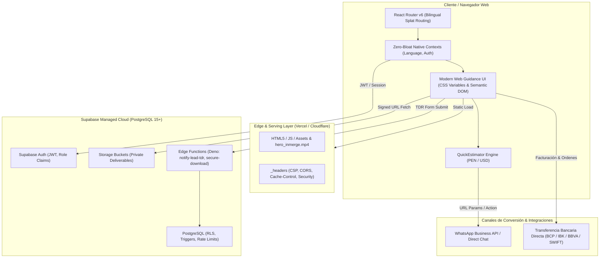

# Architecture Specification (architecture.md) — Inmerge

## 1. Architecture Spine & Core Topology

Inmerge adopta una arquitectura desacoplada, orientada al rendimiento extremo y al principio _zero-bloat_: Single Page Application (SPA) en el frontend basada en React 18 y Vite, respaldada por servicios de Backend-as-a-Service (BaaS) en Supabase (PostgreSQL 15+, Auth, Storage privado y Edge Functions en Deno).



---

## 2. Frontend Subsystem & Routing Architecture

### 2.1 Stack Tecnológico de Frontend

- **Framework:** React 18.3+ con Vite como bundler (configurado con motor Rolldown/Oxc).
- **Enrutamiento:** `react-router-dom` v6 con soporte para rutas bilingües simétricas (`/` y `/en/*`).
- **Estilos:** CSS nativo modularizado con CSS Custom Properties (tokens de diseño definidos en `:root`). Queda terminantemente prohibido el uso de librerías CSS utilitarias externas (Tailwind, Bootstrap) para garantizar un bundle ligero y máximo control editorial.
- **Iconografía & Gráficos:** SVGs en línea optimizados con motivos prehispánicos Mochica-Chimú (`MochicaPatterns.jsx`, `MochicaStepIcon.jsx`).

### 2.2 Mapa de Enrutamiento y Comportamiento de Lienzo

| Ruta (ES)    | Ruta (EN)       | Modo Visual             | Componentes Clave                                                                                                                             |
| :----------- | :-------------- | :---------------------- | :-------------------------------------------------------------------------------------------------------------------------------------------- |
| `/`          | `/en`           | Atrio 100vh             | Atrio Cinematográfico (video), `TypewriterH1`, coordenadas Mochica, portales arquitectónicos directos.                                        |
| `/servicios` | `/en/services`  | Lienzo Continuo (100vw) | Monografía de Ingeniería, Exhibición Monumental Prototipo 1:1, Lightbox 1:1, `QuickEstimator` (PEN/USD, WhatsApp directo, Alaec IA).          |
| `/nosotros`  | `/en/about`     | Lienzo Continuo         | Manifiesto de Ingeniería, Podio Ceremonial Mochica, `DirectorsCarousel` (scroll virtual), Método Inmerge (4 fases Bento) y Stack tecnológico. |
| `/contacto`  | `/en/contact`   | Lienzo Continuo         | Formulario TDR estructurado, honeypot invisible, rate limit, `MochicaDivider`, canales directos WhatsApp y Correo Formal.                     |
| `/cuenta`    | `/en/account`   | Portal Cliente          | `ProjectTimeline`, `SignedDeliverablesList`, `BankTransferInvoicing` (RUC / SWIFT).                                                           |
| `/equipo`    | _N/A (Sólo ES)_ | Consola Editorial       | Bento KPI, Command Palette (`⌘K`), Split Maestro-Detalle, Kanban Metodológico, Drawer de Entregables.                                         |
| `/cookies`   | `/en/cookies`   | Lienzo Continuo         | `CookiePolicyView`, panel de preferencias y consentimiento.                                                                                   |

### 2.3 Patrón Óptico del Header (`Navigation.jsx`)

- **Modo Transparente Cinematográfico:** Activo únicamente cuando `pathname === '/'` o `'/en'` y `scrollY <= 30px`. No posee bordes ni fondo, permitiendo que el video hero corra de borde a borde con texto claro (`#F3EADA`).
- **Modo Scrolled / Lienzo Interior:** En páginas interiores o tras hacer scroll mayor a 30px en el Home, conmuta a un fondo mineral con desenfoque (`rgba(243, 234, 218, 0.90)`, `backdrop-filter: blur(8px)`), borde sutil inferior (`var(--border)`) y tipografía oscura (`var(--ink)`).

---

## 3. Principios de Modern Web Guidance & Accesibilidad

En cumplimiento con el estándar **modern-web-guidance**:

1. **Layouts Fluidos y CSS Moderno:** Empleo de CSS Grid y Flexbox nativo; uso de `:has()`, `:user-valid` / `:user-invalid` para estados interactivos sin JavaScript redundante.
2. **View Transitions API:** Conmutación de idioma (`LanguageContext.jsx`) y cambios de vista encapsulados en `document.startViewTransition()` con fallback degradado seguro para navegadores antiguos:
   ```javascript
   if (document.startViewTransition) {
     document.startViewTransition(() => setLang(targetLang));
   } else {
     setLang(targetLang);
   }
   ```
3. **Accesibilidad WCAG 2.1 AA:**
   - Tabs y módulos navegables por teclado implementan la especificación ARIA `role="tablist"`, `role="tab"` y `role="tabpanel"`.
   - Soporte para teclas `ArrowRight`, `ArrowLeft`, `Home` y `End`.
   - Selector de idioma con `role="group"` y `aria-pressed="true|false"`.
   - Eliminación estricta de `window.alert()`. Toda alerta o confirmación se proyecta con `ToastNotification.jsx` utilizando `role="status"` (éxito/realtime) o `role="alert"` (errores de validación o acceso denegado).

---

## 4. Backend, Base de Datos & Capa de Persistencia

### 4.1 Modelo de Datos Relacional (PostgreSQL en Supabase)

El modelo relacional soporta la operación corporativa, clientes y el panel de consultores:

- `clients`: Registro corporativo de clientes, RUC (11 dígitos para Perú) / Tax ID internacional y datos de contacto.
- `projects`: Proyectos asignados, categorizados por las 3 líneas estratégicas (`web_pages`, `software_engineering`, `business_intelligence`), estado (`draft`, `in_progress`, `delivered`, `closed`), horas estimadas y presupuesto.
- `project_milestones`: Hitos de entrega por sprint con fechas y entregables asociados.
- `project_deliverables`: Archivos y documentación técnica forense con hash SHA-256 e integración a Storage privado.
- `leads_tdr`: Solicitudes entrantes desde `/contacto` con validación de tasa y procedencia.
- `orders`: Registro de órdenes de facturación correlativas (`INM-ORD-...`) basadas exclusivamente en transferencia bancaria.

### 4.2 Políticas de Seguridad Row Level Security (RLS)

- Acceso de lectura pública restringido exclusivamente a tablas informativas o de catálogo.
- La tabla `projects` y sus tablas hijas (`milestones`, `deliverables`) solo permiten lectura a usuarios autenticados cuyo `client_id` coincida con su identidad de Supabase Auth, o a roles `admin`, `engineer`, `auditor`.
- Descargas de archivos: Los buckets de Supabase Storage son completamente privados. Las descargas de entregables se realizan mediante la Edge Function `secure-download` que valida la sesión y genera una URL firmada con vencimiento corto (60 segundos).

---

## 5. Medios de Pago y Lógica de Negocio

- **Medio de Pago Exclusivo:** Transferencias Bancarias Directas a cuentas institucionales de Inmerge (BCP, Interbank, BBVA en PEN) o transferencias internacionales vía cable/SWIFT para clientes extranjeros.
- **Prohibición de Pasarelas Automáticas:** No se integran pasarelas tipo Stripe/MercadoPago para evitar comisiones innecesarias y preservar el modelo de servicio boutique B2B de alto valor.
- **Correlativo Institucional:** Cada solicitud genera una orden formal correlativa `INM-ORD-YYYYMMDD-XXXX` con validación estricta de RUC (11 dígitos numéricos peruanos) o Tax ID corporativo.

---

## 6. Pipeline de Calidad, Testing & Regresión

- **Entorno de Pruebas:** Vitest con `@testing-library/react` y emulación DOM en `jsdom`.
- **Cobertura Actual:** 38 suites de prueba unitarias, 209 pruebas automatizadas al 100% de aprobación.
- **Regla de Integración:** Ningún cambio de frontend o backend puede fusionarse si `npm test` en `web/app` reporta una sola prueba fallida o si `npm run build` genera advertencias o errores de empaquetado.
