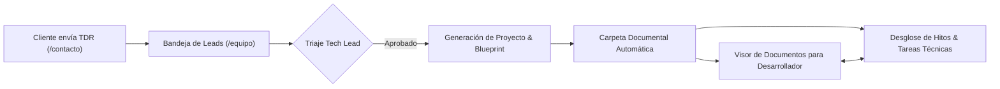

# Sesión de Brainstorming & Auditoría UX: Consola de Operaciones & Experiencia del Trabajador (/equipo)

**Fecha:** 2026-09-23  
**Orquestadora Principal:** Sally 🎨 (UX Designer & Directora de Experiencia de Usuario)  
**Mesa Redonda:** Amelia 💻 (Senior Software Engineer), Winston 🏛️ (Arquitecto de Sistemas Cloud), John 📋 (Product Manager) y Mary 📊 (Analista de Negocio & Requerimientos)  
**Estado:** Documento de Análisis & Propuestas Conceptuales de Mejora (Sin Código)  

---

## 1. Diálogo de Mesa Redonda BMAD: El Vaciado del Panel Actual

> **Contexto de la Sesión:** El equipo se reúne a evaluar la Consola de Operaciones de Inmerge (`/equipo`). A pesar de su robustez técnica y soporte en tiempo real, el trabajador técnico (desarrollador, auditor, consultor) se enfrenta a una interfaz sobrecargada de controles, con botones redundantes y una grave carencia: **los documentos del proyecto no tienen un espacio de previsualización ni de contextualización previa para que el programador entienda la arquitectura antes de comenzar a tirar código**.

🎨 **Sally (UX Designer):**
> *"Miren el panel actual. Si un desarrollador nuevo entra hoy a `/equipo`, lo primero que recibe es un muro cognitivo: 5 tarjetas de KPI arriba, barra con 4 botones de layouts, y dentro de cada proyecto 5 subpestañas que compiten entre sí con más de 12 botones y selects desplegados a la vez. Estamos cometiendo el clásico pecado de diseñar un 'CRUD de administrador' en lugar de un 'Entorno de Trabajo para el Ingeniero'.  
> Y lo más alarmante: el desarrollador no tiene cómo leer las especificaciones del proyecto. Para ver qué se acordó con el cliente, tiene que irse a una pestaña de entregables, darle a 'Descargar Auditado', esperar un enlace firmado de 15 minutos y abrir un PDF en otra pestaña. ¡Eso rompe el flujo de trabajo! La interfaz debe permitir **entender, previsualizar y ejecutar**, no adivinar."*

💻 **Amelia (Senior Developer):**
> *"Totalmente de acuerdo, Sally. Como desarrolladora, cuando me asignan a un proyecto no quiero ver 40 botones de configuración de horas ni cambiar estados administrativos. Mi primera pregunta siempre es: **¿Dónde está la arquitectura? ¿Dónde está el esquema de base de datos? ¿Qué pidió exactamente el cliente en su TDR?**  
> Hoy en día, la descripción del proyecto es una caja de texto plano minúscula donde se pegó el mensaje de contacto. Si hay un documento de especificación técnica, un diagrama o un archivo OpenAPI, no tengo dónde previsualizarlo dentro de la app. Tengo que descargar archivos a mi disco local o pedirle al Tech Lead que me mande enlaces por Slack. Necesitamos un **Visor de Documentos Integrado (In-App Document Reader)** con soporte para Markdown, diagramas y PDF."*

🏛️ **Winston (Arquitecto de Sistemas):**
> *"Desde la perspectiva de arquitectura, cometimos una confusión conceptual grave: **confundir Entregables para el Cliente con Documentación Técnica del Proyecto**.  
> En la base de datos y en la UI creamos `project_deliverables` pensando en el cliente externo (los informes forenses que Inmerge le firma y entrega). Pero el equipo técnico necesita **Documentos de Entrada y Referencia**:
> 1. El TDR original y acuerdos de alcance.
> 2. El Documento de Arquitectura y Decisiones (ADRs).
> 3. La Especificación de APIs, esquemas y credenciales sandbox.
> 4. Los entregables intermedios.  
> Además, los formularios inline de 'Agregar Hito' o 'Subir Entregable' empujan todo el árbol DOM bruscamente. Eso debe desacoplarse hacia un **Panel Lateral de Inspección (Split Workspace / Drawer)** con navegación rápida."*

📋 **John (Product Manager):**
> *"Desde producto y gestión de proyectos, el problema es que el trabajador se pierde. El desarrollador o auditor promedio no necesita ver los 15 proyectos de la firma ni todos los botones de creación; necesita un filtro intuitivo de **'Mis Proyectos / Mis Tareas de Hoy'**.  
> Además, cuando convertimos un Lead TDR a Proyecto, toda la riqueza del requerimiento del cliente se colapsa en un campo de texto simple. Debe existir una 'Cédula de Inicio de Proyecto' que sirva como documento vivo compartido."*

📊 **Mary (Business Analyst):**
> *"Exacto. La trazabilidad entre lo que el cliente redacta en el formulario de `/contacto` y lo que el desarrollador programa en el hito está rota por falta de un documento estructurado accesible. Si unimos la bandeja de leads con una carpeta documental viva por proyecto, el desarrollador entenderá el porqué de cada tarea antes de empezar el sprint."*

---

## 2. Auditoría Forense: Errores, Fricciones y Sobrecarga Actual

A continuación se detallan los hallazgos críticos detectados en la interfaz actual (`Equipo.jsx`, `ProjectsManagementView.jsx`, `ProjectTaskManager.jsx` y `ProjectRiskManager.jsx`):

### 2.1. Sobrecarga de Botones & Fatiga Visual (*Button Fatigue*)
| Ubicación | Síntoma / Error Actual | Impacto en el Trabajador |
| :--- | :--- | :--- |
| **Cabecera y Topbar** | Se presentan simultáneamente: Toggle de Sidebar, Realtime status, Role Badge, 3 KPI Pills, Buscador ⌘K, Botón `+ Opciones`, Botón `Vista Cliente` y Botón `Cerrar sesión`. | Demasiados puntos focales compitiendo en los primeros 70px de pantalla. |
| **Cabecera de Proyecto** | Cada tarjeta de proyecto repite: Select de Estado de Proyecto, Select de Salud RAG, Botón de Designar Lead, y 5 sub-botones de pestañas (`Gantt`, `Tareas`, `Riesgos`, `Hitos`, `Entregables`). | En una vista con 4 proyectos activos hay más de 35 botones y selectores visibles simultáneamente. |
| **Formularios Invasivos Inline** | Al pulsar `+ Agregar Hito` o `+ Subir Entregable`, se despliegan formularios completos de 6 a 8 campos empujando hacia abajo toda la lista. | Se pierde la posición de scroll y genera desorientación visual. |
| **Affordances de Permiso Negativo** | Para trabajadores con rol `engineer` o `auditor`, muchos selects y botones aparecen con candado `🔒` o disparan toasts de 'Permiso Denegado'. | Genera frustración y sensación de interfaz bloqueada en lugar de una experiencia de lectura fluida. |

### 2.2. Violaciones Normativas de Código y UX
- **Uso de Diálogos Nativos Bloqueantes:** En `ProjectTaskManager.jsx` (línea 99) se encuentra la instrucción `window.confirm('¿Seguro que deseas eliminar esta tarea técnica?')`.  
  > *Violación directa de la directriz Inmerge (AGENTS.md, Regla 3):* Queda terminantemente prohibido el uso de diálogos nativos bloqueantes. Toda confirmación debe ser mediante toasts no bloqueantes con opción de deshacer o modales accesibles dentro del flujo.

### 2.3. La Brecha Crítica: Aislamiento Documental del Desarrollador
1. **Inexistencia de un Visor de Documentos In-App:** El desarrollador está forzado a salir del panel para leer cualquier documento técnico o informe previo.
2. **Descarga Forzosa de Archivos:** No existe un *preview* embebido de PDFs, diagramas de arquitectura ni documentos Markdown. Todo requiere generar un enlace temporal y descargarlo al explorador del sistema operativo.
3. **Falta de Especificación Técnica Compartida:** La descripción del proyecto es una sola cadena de texto no estructurada. No hay espacio para pegar snippets de configuración, endpoints de APIs de desarrollo, repositorios vinculados ni lineamientos técnicos del proyecto.

---

## 3. Brainstorming de Mejoras & Situaciones de Diseño (Conceptuales)

### Pilar 1: Centro Documental & Visor Previo para Desarrolladores (*Engineering Knowledge Hub*)

#### A. La Cédula Técnica del Proyecto (*Project Blueprint*)
En lugar de una simple caja de descripción, cada proyecto debe tener una pestaña principal de **Especificaciones & Documentación Compartida**, estructurada en 4 carpetas lógicas:
1. **01. Briefing & TDR del Cliente:** El requerimiento original estructurado (alcance, objetivos de negocio, restricciones, personas de contacto).
2. **02. Arquitectura & Stack Técnico:** Diagramas de arquitectura (SVG / Mermaid), decisiones técnicas clave (ADRs), esquemas de base de datos y repositorios Git.
3. **03. Guía de Entorno & Sandbox:** Variables requeridas (sin secretos sensibles), endpoints base, guías de prueba local y convenciones de código.
4. **04. Entregables & Dictámenes Forenses:** Informes técnicos generados por hitos, disponibles tanto para el equipo como para el cliente.

#### B. Visor Previo a Pantalla Dividida (*In-App Split-Screen Reader*)
- Al hacer clic en cualquier documento (sea Markdown, PDF, imagen de diagrama o enlace externo):
  - **Comportamiento UX:** No abre una nueva pestaña ni descarga el archivo de inmediato. Abre un **Slide-Over Document Reader** a pantalla dividida (60% lectura / 40% tareas) o un modal modalizado editorial con fondo Arena/Crema.
  - **Soporte de Formatos:**
    - Documentos `.md`: Renderizado tipográfico editorial impecable (Space Grotesk + Space Mono), con bloques de código resaltados y soporte de tablas.
    - Documentos `.pdf`: Visor ligero embebido (`<iframe src="..." />` o canvas PDF) con controles de zoom y página, para inspeccionar auditorías sin salir de la página.
    - Diagramas de Flujo / Arquitectura: Soporte para zoom y navegación táctil de diagramas.
  - **Beneficio para el Desarrollador:** Puede tener las especificaciones abiertas a la izquierda mientras marca o actualiza sus tareas técnicas a la derecha.

---

### Pilar 2: Reducción Drástica de Botones (*Progressive Disclosure & De-Clutter*)

#### A. Principio de Divulgación Progresiva (Menos es Más)
- **Tarjeta de Proyecto Limpia (Nivel 1):**
  - Muestra únicamente: Título, Cliente, Pilar Inmerge (con su color de identidad), Barra de Progreso Ponderado, Estado, y 3 accesos directos unificados:
    - `[ 📖 Especificaciones & Docs ]`
    - `[ 📋 Mis Tareas (N) ]`
    - `[ ⋯ Más opciones ]` (menú desplegable sutil con Gantt, Riesgos y Configuración).
- **Adiós a los 5 botones de subpestañas por tarjeta:**
  - En la vista general o lista, no mostrar las 5 subpestañas a la vez dentro de cada tarjeta. La vista Maestro-Detalle (Split 60/40) o un modo expandido debe ser el único lugar donde se profundiza en las subherramientas.

#### B. Eliminación de Formularios Inline Invasivos
- Mover los formularios de "Agregar Hito" y "Subir Entregable" hacia un **Drawer Lateral Unificado** o un modal con pasos claros (`Crear Hito` -> `Asignar Responsable` -> `Adjuntar Documentación`).
- La tarjeta de proyecto se mantiene compacta, predecible y estéticamente armónica.

#### C. Filtro de Enfoque Personal (*"Mi Mesa de Trabajo"*)
- Incorporar un interruptor superior rápido en la barra de herramientas:
  - `[ Todos los Proyectos ]` | `[ ★ Mis Asignaciones ]`
- Cuando el desarrollador activa `Mis Asignaciones`:
  - Se ocultan los proyectos ajenos.
  - Solo se muestran las tareas asignadas a su usuario.
  - Se visualizan directamente los documentos que requieren su revisión o ejecución.

---

### Pilar 3: Flujo de Información entre Ventas/TDR y Desarrollo



1. **Auto-generación del Documento de Alcance:** Al convertir un Lead a Proyecto, el sistema no solo crea la fila en la base de datos, sino que genera automáticamente un documento markdown inicial: `00_tdr_alcance_inicial.md`.
2. **Contexto Inmediato:** El desarrollador asignado abre el proyecto y su primera pantalla es ese documento con el resumen del cliente, objetivos y fechas clave. Cero ambigüedad.

---

### Pilar 4: Armonización con la Identidad Editorial Inmerge

- **Tipografía y Estilo:**
  - Titulares en `Space Grotesk`, telemetría y códigos de documentos en `Space Mono`.
  - Superficies en Arena (`#F3EADA`) y Crema (`#EBDFC9`), con acentos en Terracota (`#A8472B`) para acciones primarias y Oro (`#D8A84E`) para estados de revisión.
- **Micro-interacciones Silenciosas:**
  - En lugar de confirmaciones bruscas, usar toasts con tiempo de gracia para deshacer operaciones accidentales.
  - Acciones secundarias agrupadas bajo menús desplegables discretos de 1px.

---

## 4. Arquitectura de Pantallas Propuesta (Wireframe Conceptual)

### Vista 1: Espacio de Trabajo Dividido (Split Workspace: Especificaciones + Tareas)

```text
+-----------------------------------------------------------------------------------------------+
| INMERGE OPS CONSOLE | [★ Mis Proyectos] [Todos] | 🔍 Buscar (⌘K) | 👤 Amelia (Engineer)       |
+-----------------------------------------------------------------------------------------------+
| LISTA DE PROYECTOS (30%)        | ESPACIO DE TRABAJO ACTIVO (70%)                            |
|---------------------------------|-------------------------------------------------------------|
| > Banco Ripley — Migración ECS  | PROYECTO: Banco Ripley — Migración Cloud ECS & Aurora       |
|   Pilar: 02 Cloud | 75%         | Estado: EN_DESARROLLO | Salud: 🟢 En Tiempo                 |
|                                 | Lead: Winston | Asignado: Amelia                            |
| > Rimac — Auditoría PostgreSQL  |-------------------------------------------------------------|
|   Pilar: 01 Auditoría | 40%     | [ 📖 Docs & Especificaciones ]  [ 📋 Tareas (4) ]  [ ⋯ Más ]  |
|                                 |-------------------------------------------------------------|
| > Interbank — ML Forecasting    | 📂 DOCUMENTOS & ESPECIFICACIONES TÉCNICAS                   |
|   Pilar: 03 Datos | 15%         | +---------------------------------------------------------+ |
|                                 | | [📑 TDR_Requerimientos.pdf]    -> [👁️ Previsualizar]    | |
|                                 | | [📐 Arquitectura_ECS_V2.md]     -> [👁️ Previsualizar]    | |
|                                 | | [⚡ Schema_PostgreSQL_prod.sql]  -> [👁️ Previsualizar]    | |
|                                 | +---------------------------------------------------------+ |
|                                 |                                                             |
|                                 | 👁️ PREVIEW EN VIVO: Arquitectura_ECS_V2.md                 |
|                                 | +---------------------------------------------------------+ |
|                                 | | # Especificación de Contenedores ECS Fargate            | |
|                                 | | - CPU: 1024 / Memory: 2048                              | |
|                                 | | - Secrets Manager: arn:aws:secretsmanager:...           | |
|                                 | | [Diagrama de red VPC embebido]                          | |
|                                 | +---------------------------------------------------------+ |
+-----------------------------------------------------------------------------------------------+
```

---

## 5. Matriz de Priorización de Mejoras (Backlog Conceptual)

| ID | Propuesta de Mejora | Impacto UX | Esfuerzo Estimado | Prioridad |
| :---: | :--- | :---: | :---: | :---: |
| **M-01** | **Hub de Documentos & Visor In-App (Preview Drawer):** Permitir previsualizar PDFs, Markdown y especificaciones sin forzar la descarga de archivos. | Muy Alto (Elimina el punto ciego del desarrollador) | Medio | **P0 (Crítico)** |
| **M-02** | **Reducción de Botones en Tarjetas de Proyecto:** Condensar las 5 subpestañas y múltiples selects en un encabezado limpio con divulgación progresiva. | Alto (Reduce fatiga visual y confusión) | Bajo | **P0 (Crítico)** |
| **M-03** | **Filtro de Enfoque "Mis Asignaciones":** Permitir que ingenieros y auditores vean solo los proyectos y tareas que tienen asignados. | Alto (Aumenta productividad diaria) | Bajo | **P1 (Alto)** |
| **M-04** | **Reemplazo de Formularios Inline por Drawers Laterales:** Sacar los formularios de alta de hitos y subida de archivos del flujo de tarjetas hacia un drawer enfocado. | Medio (Mejora estabilidad visual) | Bajo | **P1 (Alto)** |
| **M-05** | **Remoción de `window.confirm` en `ProjectTaskManager`:** Reemplazar diálogo nativo por confirmación elegante integrada en toast / modal conforme a las directrices de Inmerge. | Cumplimiento Normativo / Accesibilidad | Mínimo | **P1 (Alto)** |
| **M-06** | **Cédula de Inicio Automática desde Leads:** Al convertir un Lead a Proyecto, estructurar el TDR como el documento primario de especificación. | Alto (Alineación negocio-desarrollo) | Medio | **P2 (Medio)** |

---

## 6. Conclusión y Recomendación de Sally 🎨

> *"El panel actual cuenta con una base de datos excelente y sincronización en tiempo real impecable, pero ha sido concebido como un panel de control para auditores y administradores, olvidando la herramienta cotidiana del desarrollador.  
> Al implementar el **Knowledge Hub con Previsualización de Documentos**, reducir la densidad de botones a través de **divulgación progresiva** y ofrecer la vista de **'Mis Asignaciones'**, transformaremos la consola en un entorno donde el trabajador se siente guiado, empoderado y enfocado en construir software de alta precisión sin ruidos visuales ni documentos dispersos."*
