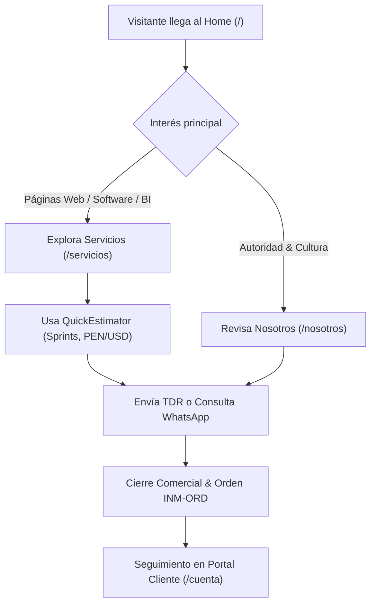

# Product Requirement Document (PRD) — Inmerge

## 1. Executive Summary & Vision

**Inmerge** es una firma boutique de consultoría en tecnología e ingeniería con sede en Lima, Perú. Frente a la burocracia, costos desmedidos y cajas negras de las consultoras corporativas tradicionales (Big 4), Inmerge se posiciona con un modelo de ejecución ágil, riguroso, radicalmente transparente y de alta densidad técnica: **soluciones claras, verificables, rápidas y a costos competitivos**.

El propósito fundamental del sitio web corporativo de Inmerge (`inmerge.pe`) es proyectar autoridad técnica de clase mundial, comunicar con absoluta claridad sus tres líneas estratégicas de servicio y canalizar la conversión calificada de clientes mediante cotizaciones interactivas transparentes y contacto directo.

---

## 2. Las Tres Líneas Estratégicas de Servicio

El sitio web y todos sus puntos de contacto comunican única y exclusivamente tres líneas de servicio:

### 2.1 Línea 01 — Páginas Web
- **Propuesta de valor:** Sitios web corporativos, plataformas web interactivas y landing pages de alto impacto visual y conversión.
- **Diferenciador:** Arquitectura moderna con rendimiento extremo (Core Web Vitals óptimos: LCP < 1.2s, CLS 0), SEO técnico internacional nativo, diseño editorial prehispánico contemporáneo (inspiración Mochica-Chimú depurada) y accesibilidad universal WCAG 2.1 AA.
- **Entregables:** Sitios web responsivos de alto rendimiento, portales corporativos bilingües, catálogos interactivos y landings de alta conversión optimizadas para captación orgánica y pauta.

### 2.2 Línea 02 — Ingeniería de Software
- **Propuesta de valor:** Desarrollo de software a medida, aplicaciones empresariales escalables y modernización de plataformas tecnológicas.
- **Diferenciador:** Arquitectura cloud de precisión en AWS/GCP (microservicios, serverless, bases de datos relacionales robustas, APIs de baja latencia), metodologías ágiles en sprints transparentes de 1 a 2 semanas y código auditado sin deuda técnica oculta.
- **Entregables:** Sistemas web a medida, APIs REST/GraphQL, refactorización y migración de legados monolíticos a la nube, automatizaciones de backend e integraciones complejas de sistemas empresariales.

### 2.3 Línea 03 — Inteligencia de Negocios
- **Propuesta de valor:** Auditoría técnica de datos, analítica avanzada, modelos predictivos y dashboards ejecutivos en tiempo real para transformar datos dispersos en decisiones verificables.
- **Diferenciador:** Cada informe o métrica expone su método de cálculo y cita su fuente de datos sin cajas negras. Rigor en la integridad, saneamiento y deduplicación de bases de datos, con modelos de Machine Learning e IA aplicada orientados al impacto financiero real.
- **Entregables:** Dashboards interactivos ejecutivos (real-time telemetry), auditorías forenses de bases de datos, canalizaciones ETL/ELT optimizadas, modelos de forecasting y consultoría en gobernanza y cumplimiento de datos.

---

## 3. Arquitectura de Navegación y Enfoque UX de Lienzo Continuo

El sitio web obedece a una regla arquitectónica visual estricta para garantizar una experiencia editorial premium sin fatiga visual:

1. **Página de Inicio (`/`, `/en`):**
   - Es la **única página dividida por secciones y bloques de colores contrastantes** (Hero cinemático oscuro sobre video, showcase de casos sobre arena `--bg`, pilares sobre crema `--cream2` y franja de conversión terracota `--terracotta`).
   - Propósito: Captura de atención, inmersión cinematográfica inmediata y muestra panorámica de capacidades.
2. **Páginas Interiores (`/servicios`, `/nosotros`, `/contacto` y rutas `/en/*`):**
   - Diseñadas como un **lienzo continuo** sobre la superficie arena cálida mineral (`--bg: #F3EADA` / `--cream2`).
   - Sin franjas de color alternas estridentes ni cajas cerradas que fragmenten la lectura.
   - Reducción sustancial de texto superfluo o redundante: foco en concisión editorial, datos tangibles y componentes funcionales directos.
3. **Aplanamiento Visual y Saneamiento de Falsos Botones:**
   - Supresión de sombras pesadas o bordes decorativos que hagan que tarjetas informativas, badges o etiquetas parezcan botones clickeables cuando no lo son.
   - Todo elemento que invite al clic debe ser inequívocamente un botón o enlace de acción (`.btn-accent`, `.btn-outline`), reservando el cursor pointer y hover states solo a elementos verdaderamente interactivos.

---

## 4. Personas y Casos de Uso (Target Audiences)

### Persona 1: Carlos Mendoza — Gerente de Operaciones / TI (Mediana Empresa, Perú)
- **Contexto:** Lidera la modernización de sistemas internos y necesita reportes claros para el directorio. Las cotizaciones de consultoras tradicionales triplican su presupuesto y exigen contratos de 6 meses antes de ver una línea de código.
- **Objetivo en Inmerge:** Evaluar las capacidades de Ingeniería de Software o Inteligencia de Negocios, simular costos y sprints en el Estimador Interactivo y agendar una llamada directa por WhatsApp con un ingeniero senior.

### Persona 2: Mariana Delgado — Founder / CEO de Scale-up (LatAm)
- **Contexto:** Requiere renovar la presencia web de su compañía con una plataforma que proyecte prestigio, solidez internacional y cargue de inmediato.
- **Objetivo en Inmerge:** Conocer la línea de Páginas Web, verificar la calidad del diseño y el rendimiento técnico, y solicitar una propuesta técnica estructurada (TDR) con desglose en semanas.

### Persona 3: David Reynolds — VP of Engineering / Tech Director (EE.UU. / Global)
- **Contexto:** Busca un partner boutique para auditoría de datos o desarrollo de módulos específicos en AWS/Supabase con huso horario compatible (GMT-5).
- **Objetivo en Inmerge:** Navegar la versión bilingüe en inglés (`/en`), revisar el stack tecnológico en `/en/about`, estimar costos en USD en `/en/services` y validar la seriedad contractual mediante transferencias bancarias internacionales (SWIFT/Wire).

---

## 5. User Journeys Principales

- **UJ-01: Descubrimiento & Cotización Ágil:** El visitante interactúa con el Estimador en `/servicios`, selecciona la línea de servicio, volumen y complejidad, visualiza el desglose en sprints de 1-2 semanas y envía el alcance preconfigurado a WhatsApp o al formulario de contacto.
- **UJ-02: Verificación de Autoridad Técnica:** El usuario entra a `/nosotros`, lee el manifiesto de ingeniería sin relleno comercial, revisa las 4 fases del Método Inmerge en el Bento Grid y valida el stack de tecnologías.
- **UJ-03: Solicitud Formal de TDR:** El cliente diligencia el formulario en `/contacto`, selecciona la línea de servicio, provee su RUC/Tax ID y recibe confirmación inmediata sin alertas bloqueantes (`ToastNotification`).
- **UJ-04: Gestión de Proyectos en Portal de Clientes:** Clientes autenticados en `/cuenta` o `/en/account` visualizan el cronograma de sus hitos, acceden a entregables técnicos mediante enlaces seguros firmados y registran pagos mediante transferencia bancaria directa.

---

## 6. Requerimientos Funcionales (FR)

- **FR-01 (Líneas de Servicio):** Todo el sitio debe articular de forma homogénea las 3 líneas (Páginas Web, Ingeniería de Software, Inteligencia de Negocios), reemplazando categorizaciones obsoletas.
- **FR-02 (Hero Cinematográfico):** La página de inicio renderiza un hero con video de fondo cinemático (`hero_inmerge.mp4`), badge estratégico y llamadas a la acción directas hacia `/servicios` y `/contacto`.
- **FR-03 (QuickEstimator Interactivo):** Componente de cálculo ágil en `/servicios` con selección de línea, complejidad, cálculo dinámico en PEN y USD, desglose por sprints de 1-2 semanas y botón de envío directo a WhatsApp.
- **FR-04 (Lienzo Continuo en Interiores):** Las páginas `/servicios`, `/nosotros` y `/contacto` deben prescindir de fondos alternos oscuros y franjas cortadas, consolidando una lectura unificada sobre fondo mineral claro.
- **FR-05 (Saneamiento de Falsos Botones):** Badges de tecnologías, indicadores de fases y rótulos informativos deben tener cursor por defecto (`default`) y estilos planos, eliminando bordes interactivos falsos.
- **FR-06 (Bilingüismo Espejo Zero-Bloat):** Soporte idiomático completo ES / EN (`/` <-> `/en`, `/servicios` <-> `/en/services`, `/nosotros` <-> `/en/about`, `/contacto` <-> `/en/contact`, `/cuenta` <-> `/en/account`) mediante React Context nativo y diccionarios tipados sin dependencias pesadas de i18n.
- **FR-07 (View Transitions):** El selector de idioma `ES | EN` en la barra de navegación debe ejecutar la transición mediante `document.startViewTransition` con fallback progresivo para navegadores sin soporte.
- **FR-08 (Formulario de Contacto TDR):** Validación en tiempo real de campos obligatorios, selector de línea de servicio, honeypot anti-spam invisible, limitación de tasa (rate limiting) y envío seguro hacia Supabase Edge Functions.
- **FR-09 (Portal de Clientes & Facturación):** Seguimiento de proyectos para roles `client` y `admin`. La facturación opera exclusivamente con transferencias bancarias directas (cuentas BCP, Interbank, BBVA en PEN y transferencias SWIFT/Wire internacionales en USD). Generación automática de código correlativo `INM-ORD-YYYYMMDD-XXXX`.
- **FR-10 (Entregables Seguros):** Los archivos técnicos de proyectos (`project_deliverables`) solo pueden ser descargados mediante URLs firmadas de corta duración auditadas (`getSignedDeliverableUrl`).
- **FR-11 (Notificaciones Accesibles):** Prohibido el uso de `window.alert()`. Todo feedback operativo debe realizarse a través de `ToastNotification` con atributos ARIA (`role="status"` o `role="alert"`).

---

## 7. Requerimientos No Funcionales (NFR)

- **NFR-01 (Rendimiento & Core Web Vitals):** LCP (Largest Contentful Paint) < 1.2s en conexiones 4G estándar; CLS (Cumulative Layout Shift) = 0; INP (Interaction to Next Paint) < 100ms.
- **NFR-02 (Accesibilidad WCAG 2.1 AA):** Contraste cromático mínimo de 4.5:1 para texto normal y 3:1 para texto grande/componentes; navegación completa por teclado; roles ARIA semánticos (`tablist`, `tab`, `tabpanel`, `dialog`, `status`, `alert`).
- **NFR-03 (Cero Bloatware / Zero-Bloat):** Prohibido el uso de librerías CSS externas (Bootstrap, Tailwind) o paquetes pesados de i18n/componentes. La interfaz utiliza CSS variables nativas y React 18 puro.
- **NFR-04 (Seguridad de Datos):** Supabase Row Level Security (RLS) habilitado en el 100% de tablas públicas y de gestión; validación y saneamiento de entradas en cliente y Edge Functions.
- **NFR-05 (Confiabilidad y Testing):** La suite completa de pruebas unitarias (`npm test` en `web/app`) debe mantenerse al 100% de aprobación (38 suites, 200+ tests) ante cada iteración de código.
- **NFR-06 (Compilación Limpia):** El comando `npm run build` debe generar el bundle de distribución sin errores sintácticos, advertencias de exportación ni problemas de empaquetado.

---

## 8. Métricas de Éxito y Contra-métricas

| Métrica de Éxito | Meta | Contra-métrica a Monitorear | Límite Aceptable |
| :--- | :--- | :--- | :--- |
| Tasa de conversión a cotización (Estimador / Contacto) | > 4.5% de visitantes únicos | Tasa de rebote en `/servicios` | < 35% |
| Clics en "Cotizar por WhatsApp" | > 12% de usuarios que usan el Estimador | Consultas de soporte por spam o bots | < 1% de leads |
| Tiempo de carga percibido (LCP) | < 1.2s | Tamaño del bundle inicial JavaScript | < 180 kB gzip |
| Navegabilidad por teclado y accesibilidad | 100% en auditoría axe/Lighthouse | Quejas de accesibilidad o contraste | 0 incidencias |
