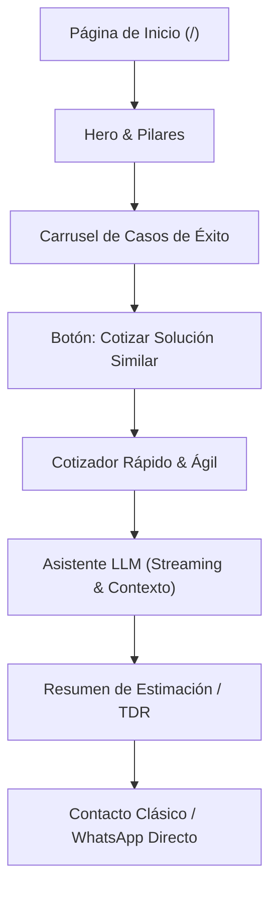
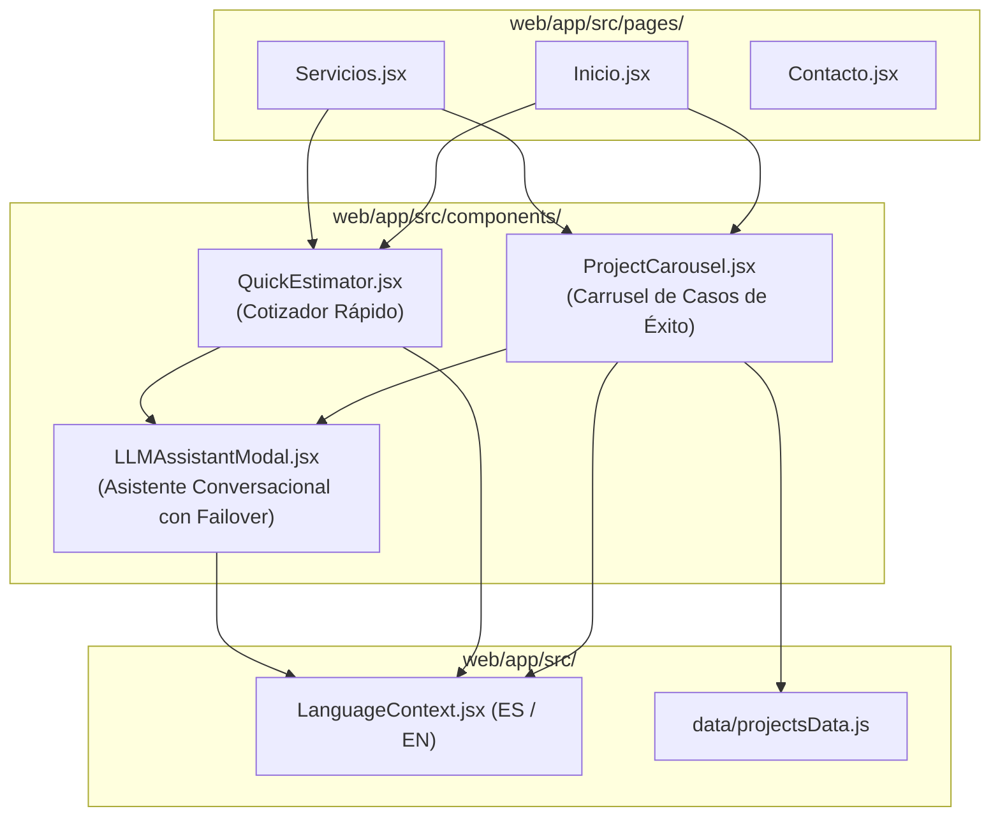

# Diagramas de Arquitectura & Flujo de Componentes

## 1. Flujo de Navegación y Conversión Web

```mermaid
flowchart TD
    Home["Página de Inicio (/)"] --> Hero["Hero & Pilares"]
    Hero --> Carousel["Carrusel de Casos de Éxito"]
    Carousel --> ContextCTA["Botón: Cotizar Solución Similar"]
    ContextCTA --> Estimator["Cotizador Rápido & Ágil"]
    Estimator --> LLMAssistant["Asistente LLM (Streaming & Contexto)"]
    LLMAssistant --> OrderReview["Resumen de Estimación / TDR"]
    OrderReview --> FormContact["Contacto Clásico / WhatsApp Directo"]
```

## 2. Topología de Componentes Frontend

```mermaid
graph TD
    subgraph UI_Components ["web/app/src/components/"]
        PC["ProjectCarousel.jsx<br/>(Carrusel de Casos de Éxito)"]
        QE["QuickEstimator.jsx<br/>(Cotizador Rápido)"]
        LA["LLMAssistantModal.jsx<br/>(Asistente Conversacional con Failover)"]
    end

    subgraph Pages ["web/app/src/pages/"]
        Inicio["Inicio.jsx"]
        Servicios["Servicios.jsx"]
        Contacto["Contacto.jsx"]
    end

    subgraph Context_Data ["web/app/src/"]
        LC["LanguageContext.jsx (ES / EN)"]
        ProjectsData["data/projectsData.js"]
    end

    Inicio --> PC
    Inicio --> QE
    Servicios --> PC
    Servicios --> QE
    PC --> LA
    QE --> LA
    PC --> ProjectsData
    PC --> LC
    QE --> LC
    LA --> LC
```
