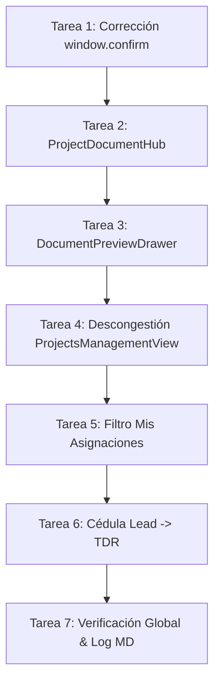

# Plan de Implementación: Hub Documental & Descongestión UX del Panel de Operaciones (/equipo)

> **Para agentes ejecutores:** MODELO OBJETIVO: Gemini Flash 3.6 (Medium Quality).
> **REGLAS FUNDAMENTALES ANTI-ALUCINACIÓN:**
> 1. **Prohibido inventar paquetes npm:** No instalar librerías externas. Usar exclusivamente React nativo, hooks existentes y variables CSS del sistema de diseño Inmerge.
> 2. **Prohibido romper contratos de datos:** No modificar nombres de columnas de Supabase ni alterar la estructura de retorno de `lib/team.js` o `lib/pm.js`.
> 3. **Prohibido usar diálogos nativos bloqueantes:** Nunca usar `window.alert()` ni `window.confirm()`.
> 4. **Idioma de la consola:** Mantener el panel `/equipo` 100% en español técnico.
> 5. **Trazabilidad obligatoria:** Cada tarea completada DEBE registrarse inmediatamente en `docs/decisions-log.md` antes de pasar a la siguiente.
> 6. **Cero código en este plan:** Este plan contiene especificaciones funcionales, contratos, pasos y criterios de aceptación, no implementaciones en código.

---

## 1. Resumen del Objetivo

Transformar la Consola de Operaciones de Inmerge (`/equipo`) de un panel administrativo sobrecargado a un **entorno de trabajo limpio, ágil y centrado en el desarrollador**, resolviendo dos problemas críticos:
1. **Punto Ciego Documental:** Los desarrolladores no pueden consultar ni previsualizar especificaciones técnicas, TDRs ni diagramas antes de codificar.
2. **Fatiga por Botones (Button Fatigue):** Cada tarjeta de proyecto contiene decenas de controles simultáneos y formularios invasivos que rompen el flujo de trabajo.

---

## 2. Invariantes del Proyecto & Restricciones Globales

- **Superficie y Paleta:** Lienzo Arena mineral (`--bg: #F3EADA`), paneles en Crema (`--cream2: #EBDFC9`), acentos en Terracota (`--terracotta: #A8472B`), Oro (`--gold: #D8A84E`), Tinta (`--ink: #241A12`) y bordes (`--border: #D8CCA8`).
- **Tipografía:** Títulos e interfaces en `Space Grotesk`, telemetría y metadatos en `Space Mono`.
- **Compatibilidad de Tests:** La suite completa de Vitest (38 suites, 205 tests) debe mantenerse en verde al 100% en todo momento.
- **Auditoría de Cambios:** Al finalizar cada tarea, se debe registrar el cambio en `docs/decisions-log.md`.

---

## 3. Desglose de Tareas de Implementación

---

### Tarea 1: Corrección de Cumplimiento Normativo en Tareas Técnicas

**Archivos involucrados:**
- Modificar: `web/app/src/components/ProjectTaskManager.jsx` (líneas 98-107)
- Test: `web/app/src/components/ProjectTaskManager.test.jsx`

**Lineamientos de Implementación:**
- Localizar la función `handleDelete` en `ProjectTaskManager.jsx`.
- Eliminar de inmediato la llamada nativa `window.confirm()`.
- Implementar un estado interno en el componente (`deletingTaskId: null | string`) para confirmación en dos pasos:
  - Al primer clic sobre el icono de eliminar, el botón cambia su estado visual a "Confirmar eliminación" con tiempo de espera o cancelación al hacer clic fuera.
  - Al segundo clic, se ejecuta `onTaskDeleted(taskId, projectId)`.
- Si se cancela o no se confirma en 4 segundos, el estado se resetea automáticamente.
- Asegurar que no se alteren las props existentes de `ProjectTaskManager`.

**Criterios de Aceptación:**
- Ninguna instrucción `window.confirm` ni `window.alert` debe existir en el archivo.
- Los tests existentes de `ProjectTaskManager.test.jsx` deben pasar sin errores.

**Verificación:**
- Comando: `npm test -- src/components/ProjectTaskManager.test.jsx`
- Registro en Bitácora: Agregar entrada en `docs/decisions-log.md` detallando la remoción del diálogo nativo.

---

### Tarea 2: Creación del Hub de Especificaciones & Documentos (`ProjectDocumentHub.jsx`)

**Archivos involucrados:**
- Crear: `web/app/src/components/team/ProjectDocumentHub.jsx`
- Crear: `web/app/src/components/team/ProjectDocumentHub.test.jsx`

**Contrato de Interfaces y Props:**
- **Props de Entrada:**
  - `project`: Objeto del proyecto con campos `id`, `title`, `description`, `pillar`, `status`, `client`, `created_at`.
  - `deliverables`: Array de entregables asociados (`id`, `title`, `file_type`, `file_path`, `external_url`, `version`, `notes`, `created_at`).
  - `isAdmin`: Booleano para control de permisos de subida.
  - `onOpenPreview`: Función callback `(documentObject) => void`.
  - `onUploadClick`: Función callback opcional para abrir el drawer de subida.
- **Estructura Visual y Funcional:**
  - Debe renderizar 4 secciones documentales claramente rotuladas:
    1. **01. Briefing & Alcance Técnico (TDR):** Extrae y estructura la descripción del proyecto o requerimiento del cliente. Si contiene encabezados o secciones, mostrarlas formateadas con jerarquía.
    2. **02. Arquitectura de Solución & Stack:** Espacio para visualizar diagramas, lineamientos de diseño de software y decisiones técnicas.
    3. **03. Entorno Sandbox & APIs:** Guía de conexión para desarrolladores (endpoints, variables públicas requeridas, reglas de rama Git).
    4. **04. Entregables & Dictámenes Forenses:** Lista los entregables registrados en `project.deliverables` con sus metadatos (versión, fecha, notas).
  - Cada fila o tarjeta de documento debe contar con:
    - Indicador visual del tipo de archivo (`TDR`, `MD`, `PDF`, `URL`, `SQL`, `ZIP`).
    - Título del documento y versión.
    - Botón primario: `[ 👁️ Previsualizar ]` que invoca `onOpenPreview(doc)`.
    - Si es entregable y tiene archivo descargable, botón secundario: `[ ⬇ Descargar ]`.
  - Estados vacíos amigables cuando no haya documentos en una categoría.

**Criterios de Aceptación:**
- El componente no debe importar ninguna librería externa que no esté en `package.json`.
- Todo el estilo debe usar variables CSS estándar (`var(--ink)`, `var(--bg)`, `var(--cream2)`, `var(--terracotta)`, `var(--border)`).
- La suite de tests unitarios debe validar el renderizado de las 4 secciones y la emisión del evento `onOpenPreview`.

**Verificación:**
- Comando: `npm test -- src/components/team/ProjectDocumentHub.test.jsx`
- Registro en Bitácora: Anotar en `docs/decisions-log.md`.

---

### Tarea 3: Creación del Visor de Previsualización In-App (`DocumentPreviewDrawer.jsx`)

**Archivos involucrados:**
- Crear: `web/app/src/components/team/DocumentPreviewDrawer.jsx`
- Crear: `web/app/src/components/team/DocumentPreviewDrawer.test.jsx`

**Contrato de Interfaces y Props:**
- **Props de Entrada:**
  - `isOpen`: Booleano que indica si el drawer está visible.
  - `onClose`: Función callback para cerrar el drawer.
  - `document`: Objeto documento a inspeccionar (`{ title, fileType, content, url, notes, version, author }`).
- **Comportamiento y UX:**
  - Implementar panel deslizante lateral (*Slide-Over Sheet*) o vista dividida modal con `role="dialog"`, `aria-modal="true"`.
  - Soporte de cierre mediante tecla `Escape` y clic sobre el overlay de fondo.
  - Cabecera con título del documento, badge de tipo/versión y botón `✕ Cerrar`.
  - **Renderizado por tipo de contenido:**
    - Si el documento contiene texto/markdown (`content`): renderizar con tipografía editorial de alta legibilidad, bloques preformateados para código o listas con `Space Mono`.
    - Si es un archivo PDF o enlace externo accesible (`url`): incrustar un visor embebido seguro (`<iframe>` con `sandbox="allow-scripts allow-same-origin"`) y proveer un botón directo de "Abrir en nueva pestaña".
    - Si no hay contenido previsualizable directo: mostrar tarjeta con las notas técnicas del documento y botón de descarga auditada.
  - Barra inferior con metadatos de auditoría: fecha de creación, versión y notas técnicas.

**Criterios de Aceptación:**
- No bloquear el hilo principal de la aplicación.
- Accesibilidad WCAG 2.1 AA: foco atrapado en el drawer cuando está abierto y restauración del foco al cerrar.
- Tests unitarios que verifiquen montaje, desmontaje, cierre con `Escape` y renderizado de texto/iframe.

**Verificación:**
- Comando: `npm test -- src/components/team/DocumentPreviewDrawer.test.jsx`
- Registro en Bitácora: Anotar en `docs/decisions-log.md`.

---

### Tarea 4: Descongestión de Botones & Divulgación Progresiva en `ProjectsManagementView.jsx`

**Archivos involucrados:**
- Modificar: `web/app/src/components/team/ProjectsManagementView.jsx`
- Test: `web/app/src/pages/Equipo.test.jsx`

**Lineamientos de Refactorización:**
- **Reducción de Controles en la Tarjeta de Proyecto:**
  - Eliminar la barra fija horizontal de 5 pestañas simultáneas por cada tarjeta.
  - Reemplazarla por un grupo de navegación contextual limpio de 3 accesos:
    1. `[ 📖 Especificaciones & Docs ]`: Renderiza el nuevo `<ProjectDocumentHub />`.
    2. `[ 📋 Tareas Técnicas (N) ]`: Renderiza `<ProjectTaskManager />`.
    3. `[ ⋯ Más Herramientas ]`: Selector desplegable que permite activar `📊 Cronograma Gantt`, `⚠️ Matriz de Riesgos` o `📌 Fases & Hitos`.
- **Eliminación de Formularios Inline Invasivos:**
  - Retirar los bloques de formularios de agregar hitos (`addingMilestoneProjId`) y subir entregables (`uploadingDeliverableProjId`) que empujan el DOM dentro de la lista.
  - Canalizar estas acciones directamente hacia el Drawer de Opciones existente (`isDrawerOpen` de `Equipo.jsx`) o abrir un modal flotante no invasivo.
- **Integración del Visor de Documentos:**
  - Mantener un estado `previewDoc` en `ProjectsManagementView` o recibirlo como prop.
  - Al hacer clic en previsualizar dentro de `ProjectDocumentHub`, levantar `<DocumentPreviewDrawer />`.
- **Preservación de Vistas Alternas:**
  - Garantizar que las vistas `LIST`, `GRID`, `SPLIT` y `KANBAN` sigan operando correctamente con la nueva estructura simplificada.

**Criterios de Aceptación:**
- Reducción medible del número de botones visibles por tarjeta en reposo (de >12 controles a 3 botones principales).
- Cero regresiones en la creación y actualización de hitos, tareas o entregables.
- Todos los tests de la suite pasan.

**Verificación:**
- Comando: `npm test -- src/pages/Equipo.test.jsx`
- Registro en Bitácora: Anotar en `docs/decisions-log.md`.

---

### Tarea 5: Filtro de Enfoque "Mis Asignaciones" en la Consola (`Equipo.jsx`)

**Archivos involucrados:**
- Modificar: `web/app/src/pages/Equipo.jsx`
- Modificar: `web/app/src/styles/index.css` (para el selector píldora de enfoque si se requiere)
- Test: `web/app/src/pages/Equipo.test.jsx`

**Lineamientos de Implementación:**
- Añadir un nuevo estado reactivo en `Equipo.jsx`: `viewScope` con valores `'ALL' | 'ASSIGNED'`, por defecto `'ALL'`.
- En la subcabecera del workspace (o en el Topbar junto a los KPIs), agregar un selector de enfoque tipo pestaña o píldora editorial:
  - `[ Todos los Proyectos ]` | `[ ★ Mis Asignaciones ]`
- **Lógica de Filtrado Inteligente:**
  - Si el usuario selecciona `Mis Asignaciones`:
    - Filtrar el arreglo de proyectos pasando a `ProjectsManagementView` únicamente aquellos donde:
      a) `proj.tech_lead_contact` coincida con el email del usuario logueado, O
      b) Algún hito en `proj.milestones` tenga `assigned_to_email` igual al email del usuario, O
      c) Alguna tarea en `proj.tasks` tenga `assigned_to_email` igual al email del usuario.
    - Si el usuario no tiene proyectos asignados, mostrar una tarjeta vacía clara: *"No tienes proyectos ni tareas asignadas actualmente. Consulta con tu Tech Lead."*
- Si `viewScope` es `'ALL'`, mostrar la totalidad de proyectos como siempre.

**Criterios de Aceptación:**
- El desarrollador o auditor puede aislar su carga de trabajo con un solo clic.
- Los administradores pueden seguir alternando entre ambas vistas con fluidez.
- No afecta las llamadas a Supabase ni a la suscripción Realtime.

**Verificación:**
- Comando: `npm test -- src/pages/Equipo.test.jsx`
- Registro en Bitácora: Anotar en `docs/decisions-log.md`.

---

### Tarea 6: Trazabilidad Automática Lead TDR -> Documento Inicial de Requerimientos

**Archivos involucrados:**
- Modificar: `web/app/src/pages/Equipo.jsx` (función `handleConvertLeadToProject`)
- Test: `web/app/src/pages/Equipo.test.jsx`

**Lineamientos de Implementación:**
- En la función `handleConvertLeadToProject(lead)` de `Equipo.jsx`:
- En lugar de simplemente concatenar cadenas en el campo `description`, formatear el requerimiento como una Cédula Técnica estructurada con encabezados Markdown limpios:
  - `# CÉDULA DE ALCANCE INICIAL (TDR)`
  - `## 1. Requerimiento del Cliente`
  - `## 2. Información de Contacto & Empresa`
  - `## 3. Plazo Estimado & Pilar Inmerge`
  - `## 4. Notas de Triaje del Tech Lead`
- De este modo, cuando el desarrollador abra la sección `01. Briefing & Alcance` dentro de `ProjectDocumentHub`, encontrará un documento ordenado y jerarquizado listo para lectura.

**Criterios de Aceptación:**
- Al convertir un lead, el nuevo proyecto cuenta con una descripción semántica y estructurada.
- Los tests existentes de conversión de leads se actualizan para validar el nuevo formato sin romper aserciones.

**Verificación:**
- Comando: `npm test -- src/pages/Equipo.test.jsx`
- Registro en Bitácora: Anotar en `docs/decisions-log.md`.

---

### Tarea 7: Validación de Calidad Global, Build y Generación de Bitácora Final

**Archivos involucrados:**
- Modificar: `docs/decisions-log.md`
- Crear: `docs/brainstorming/brainstorm-ux-panel-trabajador-2026-09-23/cambios-implementados.md`

**Lineamientos de Implementación:**
- Ejecutar la suite completa de pruebas automatizadas: `npm test -- --run`.
- Ejecutar el linter y verificador de formato: `npm run lint`.
- Compilar la aplicación para verificar el empaquetado de producción: `npm run build`.
- Redactar el documento final `cambios-implementados.md` resumiendo:
  1. Componentes creados y modificados con sus justificaciones de diseño.
  2. Métricas de reducción de controles visuales (antes vs después).
  3. Evidencias de pruebas unitarias exitosas (captura de ejecución de tests).
  4. Guía rápida para el trabajador: cómo usar el Hub Documental y el filtro de asignaciones.

**Criterios de Aceptación:**
- 100% de tests en verde (38+ suites, 205+ tests).
- Build limpio sin errores ni advertencias críticas de compilación.
- Documento final completo y accesible para revisión del usuario.

---

## 4. Matriz de Dependencias y Orden de Ejecución



---

## 5. Protocolo de Registro de Cambios para Agentes (Changelog Protocol)

Cada agente ejecutor DEBE añadir un bloque estructurado en `docs/decisions-log.md` tras completar cada tarea siguiendo este formato exacto:

```text
### [YYYY-MM-DD HH:MM] Tarea N: [Título de la Tarea]
- Agente Ejecutor: [Nombre del Agente / Rol]
- Archivos modificados/creados: [Lista de rutas de archivo]
- Resumen del cambio: [Explicación concisa del cambio y qué bug/fricción resolvió]
- Verificación ejecutada: [Comando de test y resultado obtenido]
- Estado: APROBADO / EN VERIFICACIÓN
```
