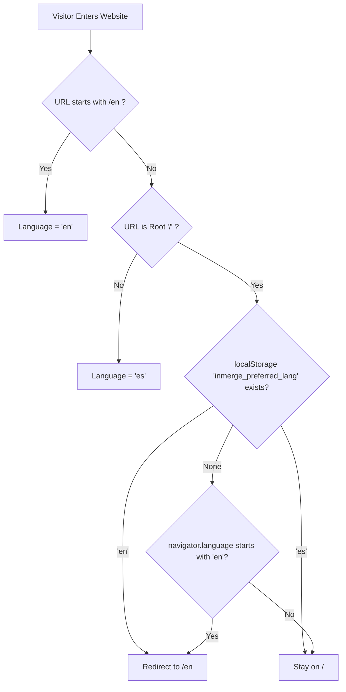

# Inmerge Bilingual Experience Specification (EXPERIENCE.md)

Behavioral specification, information architecture, interaction design, accessibility rules, and user journeys for the bilingual system (Spanish / English) of Inmerge.

---

## 1. Foundation

### 1.1 Technical & UI Architecture

- **Framework:** React 18 SPA bundled with Vite.
- **Routing:** Client-side routing powered by `react-router-dom` (v6).
- **Styling Paradigm:** Vanilla CSS driven by brand design tokens (`var(--bg)`, `var(--ink)`, `var(--terracotta)`, `var(--gold)`).
- **Core Principles:**
  - Zero heavy third-party localization bloat.
  - Predictable URL routing with bi-directional synchronization.
  - Full Core Web Vitals integrity (no Cumulative Layout Shift during hydration or language toggle).

---

## 2. Information Architecture & Routing

### 2.1 Bilingual Route Mapping Matrix

Every public showcase surface has a deterministic counterpart in English:

| Surface Intent       | Spanish Canonical Route | English Canonical Route | Document Title (ES / EN)                                                                                                                    |
| :------------------- | :---------------------- | :---------------------- | :------------------------------------------------------------------------------------------------------------------------------------------ |
| **Landing / Hero**   | `/`                     | `/en`                   | `Inmerge — Consultoría en Software, Auditoría de Sistemas y Datos` / `Inmerge — Software Engineering, Systems Audit & Applied Data Science` |
| **Services Catalog** | `/servicios`            | `/en/services`          | `Servicios de Ingeniería y Auditoría — Inmerge` / `Engineering & Systems Auditing Services — Inmerge`                                       |
| **Firm & Manifesto** | `/nosotros`             | `/en/about`             | `Nosotros — Manifiesto y Equipo de Inmerge` / `About Us — Engineering Manifesto & Inmerge Team`                                             |
| **Contact & TDR**    | `/contacto`             | `/en/contact`           | `Contacto y Solicitud Técnica — Inmerge` / `Contact & Technical Project Request — Inmerge`                                                  |
| **Cookies Policy**   | `/cookies`              | `/en/cookies`           | `Política de Cookies — Inmerge` / `Cookie Policy — Inmerge`                                                                                 |

### 2.2 Boundary of Scope (Public vs Portal)

- **Public Showcase (`/` and `/en/*`):** 100% bilingually mirrored (`/` <-> `/en`, `/servicios` <-> `/en/services`, `/nosotros` <-> `/en/about`, `/contacto` <-> `/en/contact`, `/cookies` <-> `/en/cookies`).
- **Client Authentication & Client Portal (`/login` <-> `/en/login`, `/registro` <-> `/en/register`, `/cuenta` <-> `/en/account`):** Fully mirrored bilingually with dual fiscal support (Peruvian RUC 11 digits & bank transfers in PEN; international Tax ID & SWIFT transfers in USD).
- **Engineering Console (`/equipo`):** Retained exclusively in Spanish for internal engineering operations in Lima, Peru.

---

## 3. Voice and Tone (Microcopy & Localization Strategy)

### 3.1 Editorial Authority in English

The English translation adheres strictly to executive engineering standards (_CTO-to-CTO_ conversation):

- **Avoid:** Buzzwords like "rockstar developers", "ninja coders", or "game-changing solutions".
- **Enforce:** Accurate engineering and auditing vocabulary:
  - _Pilar 01:_ "Technical & Data Auditing" (Database Integrity, Schema Consistency, AWS/GCP Compliance).
  - _Pilar 02:_ "Cloud Development & Architecture" (ECS Microservices, Lambda, Resilient Data Stores, Custom APIs).
  - _Pilar 03:_ "Applied Data Science & Artificial Intelligence" (Predictive Modeling, Forecasting, Generative Agents, Real-Time Executive Dashboards).

### 3.2 Dynamic Microcopy Mapping

- **CTAs:**
  - _ES:_ "Iniciar proyecto" / "Cotizar auditoría" / "Agendar sesión técnica"
  - _EN:_ "Initiate Project" / "Request Audit Scope" / "Schedule Technical Consultation"
- **WhatsApp Pre-filled Intent:**
  - _ES:_ `"Hola Inmerge, deseo coordinar una evaluación técnica para mi empresa..."`
  - _EN:_ `"Hello Inmerge team, I would like to schedule a technical consultation regarding software engineering and systems auditing..."`

---

## 4. Component Patterns & Behavior

### 4.1 Language Switcher (`LanguageSwitcher.jsx`)

- **Location:**
  - Desktop: Inside `Nav.jsx`, adjacent to the session button.
  - Mobile: Inside `MobileMenu.jsx`, positioned at the header level.
- **Switching Mechanism:**
  - When the user is at `/servicios` and clicks `EN`, the router navigates immediately to `/en/services`.
  - When the user is at `/en/about` and clicks `ES`, the router navigates to `/nosotros`.
  - Scroll position is smoothly preserved across switching when the user is mid-page.
  - Active selection is instantly written to `localStorage.setItem('inmerge_preferred_lang', lang)`.

### 4.2 Route Transition & Scroll Behavior

- When navigating between pages within the same language, `ScrollToTop.jsx` resets scroll to `(0, 0)`.
- When switching language on the exact same page, the vertical scroll offset is preserved to prevent disorienting jumps.

---

## 5. State Patterns & Language Resolution

### 5.1 Hydration & Resolution Order

The system resolves the active language in the following strict hierarchy:



1. **Explicit URL route:** If the path starts with `/en`, language is strictly `en`.
2. **Direct deep links in Spanish:** If accessing `/servicios`, no redirect occurs; user stays on Spanish.
3. **First-time entry to `/`:**
   - If `localStorage` has `en`, redirects to `/en`.
   - If no `localStorage` exists, inspects `navigator.language`. If English-first, redirects to `/en`.
   - Otherwise, remains at `/`.

---

## 6. Interaction Primitives & Accessibility Floor

### 6.1 Keyboard Navigation & ARIA

- The Language Switcher is structured as a semantic group:
  ```html
  <div role="group" aria-label="Language selector" className="lang-switcher">
    <button
      type="button"
      aria-label="Cambiar a Español"
      aria-pressed={currentLang === 'es'}
      className={currentLang === 'es' ? 'active' : ''}
    >
      ES
    </button>
    <button
      type="button"
      aria-label="Switch to English"
      aria-pressed={currentLang === 'en'}
      className={currentLang === 'en' ? 'active' : ''}
    >
      EN
    </button>
  </div>
  ```
- **Focus Indicators:** Visible 2px gold focus ring (`var(--gold)`) with outline offset on `:focus-visible`.
- **Screen Reader Synchronization:**
  - Toggling language automatically updates `document.documentElement.lang` to `"en"` or `"es"`.
  - Dynamic announce: `aria-live="polite"` region notifies: _"Página cambiada a Inglés"_ / _"Page switched to English"_.

---

## 7. SEO & Modern Web Guidance

### 7.1 Search Engine Metadata

Every route renders appropriate alternate link relationships in `<head>`:

```html
<!-- On /servicios -->
<link rel="canonical" href="https://inmerge.pe/servicios" />
<link rel="alternate" hreflang="es" href="https://inmerge.pe/servicios" />
<link rel="alternate" hreflang="en" href="https://inmerge.pe/en/services" />
<link
  rel="alternate"
  hreflang="x-default"
  href="https://inmerge.pe/servicios"
/>

<!-- On /en/services -->
<link rel="canonical" href="https://inmerge.pe/en/services" />
<link rel="alternate" hreflang="es" href="https://inmerge.pe/servicios" />
<link rel="alternate" hreflang="en" href="https://inmerge.pe/en/services" />
<link
  rel="alternate"
  hreflang="x-default"
  href="https://inmerge.pe/servicios"
/>
```

---

## 8. Key Flows (Named-Protagonist Journeys)

### 8.1 Journey 1: Marcus, VP of Engineering (San Francisco, FinTech)

- **Context:** Looking for elite nearshore software engineering and systems auditing partners in Latin America with AWS expertise.
- **Entry:** Marcus clicks a shared link on LinkedIn pointing to `https://inmerge.pe`.
- **Step 1:** System detects his browser language (`en-US`) and clean redirects him to `https://inmerge.pe/en`.
- **Step 2:** The Hero video loads smoothly; the headline reads: _"High-Density Software Engineering, Systems Auditing & Applied Data Science"_. The nav displays the `ES | EN` pill with `EN` highlighted.
- **Step 3:** Marcus explores the Pillars: _"01 Technical & Data Auditing"_, _"02 Cloud Development & Architecture"_, _"03 Applied Data Science & AI"_.
- **Climax Beat:** In the architecture diagram, he reviews the AWS ECS, RDS, and automated testing layers. Impressed by the engineering rigor, he clicks _"Schedule Technical Consultation"_, landing on `/en/contact`.
- **Resolution:** Marcus fills out the structured TDR form in English and submits his project requirements with response commitment under 24 hours.

---

### 8.2 Journey 2: Valeria, Directora de TI (Lima, Corporativo Retail)

- **Context:** Evaluating Inmerge for a database migration and technical audit in Peru, but needs to present vendor credentials to her global regional board.
- **Entry:** Lands on `https://inmerge.pe/` in Spanish.
- **Step 1:** Reviews the services catalog at `/servicios`.
- **Step 2:** To check how Inmerge presents its technical stack to foreign stakeholders, she clicks `EN` in the navbar.
- **Climax Beat:** The page smoothly updates to `/en/services` without losing her place. The service titles, deliverables, and architecture accords are displayed in pristine English.
- **Resolution:** She copies the `/en/services` link and shares it directly in an email to her regional CTO, then switches back to `ES` to initiate conversation with Inmerge via local WhatsApp.
